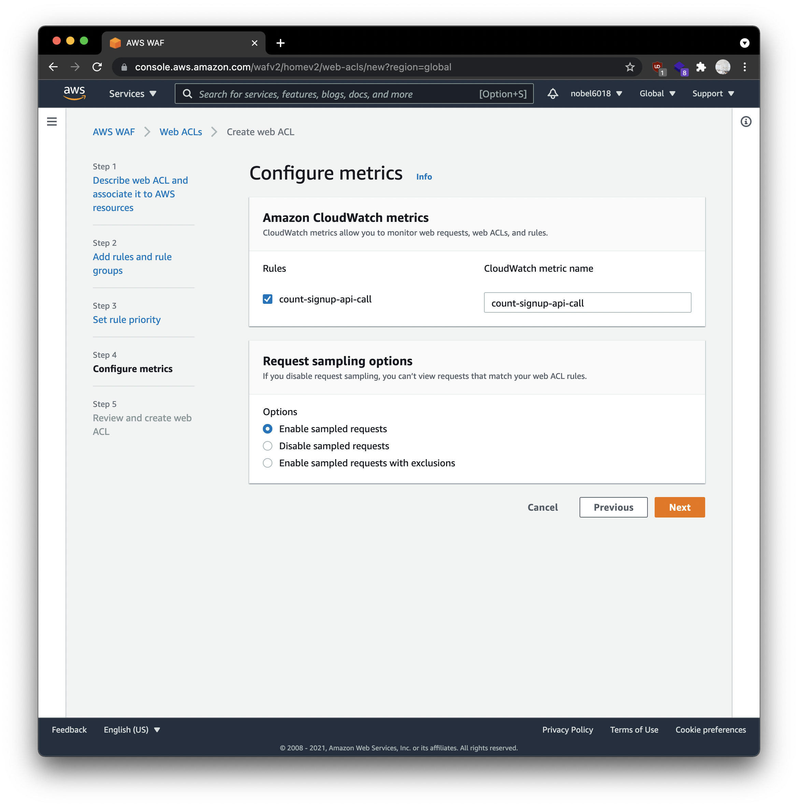

### 들어가며

한 명이 구글 소셜 회원가입을 다량으로 하는 abusing 문제가 있습니다.

해당 abusing을 막기 위해 해당 IP를 block 시키기로 했습니다.

AWS WAF를 이용하여 회원가입 API 호출하는 IP를 로깅하고 특정 기준에 따라 block하는 방법을 기록으로 남깁니다

### Web ACL 생성

1. AWS WAF & Shield에 들어갑니다

2. 왼쪽 탭에서 `Web ACLs` 에 들어갑니다

3. 원하는 리전을 선택하고 `Create Web ACL` 을 누릅니다 저는 리전을 `Global (CloudFront)` 로 선택하였습니다

   

4. 이름(Name)을 적고 AWS resources를 선택하고 완료되면 Next를 누릅니다

   

5. `Add my own rules and rule groups` 를 선택합니다

   

6. Rule을 작성합니다

   저는 Google social 회원가입을 호출하는 유저의 IP를 탐지하기 위해 `/api/v1/signUp/sns/google` API 요청을 Count하는 Rule을 만들었습니다

   

7. Rule을 넣고 Next를 누릅니다

   

8. Rule의 우선순위를 선택합니다

   

9. CloudWatch에서 모니터링할 Rule을 선택하고, Request 요청을 샘플링 옵션을 선택합니다

   

10. 설정한 ACL을 확인하고 올바르면 생성합니다

   

### 트래픽을 로깅하기

1. 해당 ACL로 들어가서 `Loggin and metrics` 탭으로 이동하고 로깅을 활성화 합니다

   

2. 저는 CloudWatch logs로 로깅하기를 선택합니다

   그리고 현재 CloudWatch Logs의 log group이 없기 때문에 `Create new` 를 눌러 만들어줍니다

   

3. 로그 그룹 이름을 넣어주고 보유 기간(Retention Setting)을 설정합니다

   이름은 반드시 `aws-waf-logs-` 로 시작해야 합니다

   

4. Filter를 설정하고 Save를 합니다

   Count Action에 대해서만 log를 남기고 나머지 로그들은 남기지 않는 설정을 하였습니다

   

5. ACL에 들어와서 CloudWatch Log insights 기능을 사용해서 호출이 많은 IP를 확인합니다

   `Top 100 IP addresses` 를 누르면 다음의 query를 확인할 수 있습니다

   

   쿼리를 실행하면 IP 당 호출 횟수를 알 수 있습니다. IPv4 또는 IPv6가 잡히는 것을 확인할 수 있습니다.

   
